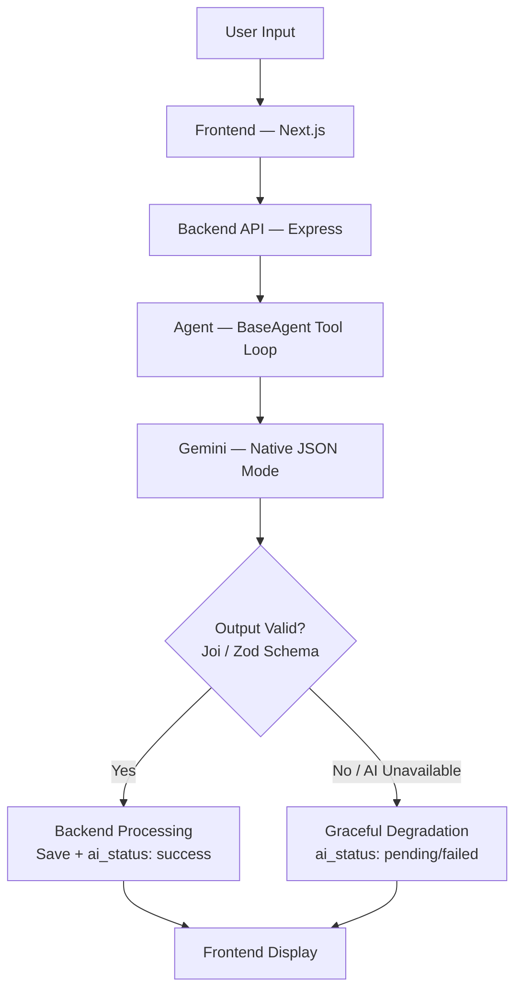

# Enterprise NeXus
### Multi-Agent AI Business Automation OS with Security Intelligence

---

## Team Information

| Field | Details |
|---|---|
| **Course Code** | CSE4204 |
| **Section** | 8B |
| **Team Number** | T04 |
| **Official Team Name** | CSE4204-8B-T04 |
| **Project Title** | Enterprise NeXus — Multi-Agent AI Business Automation OS with Security Intelligence |

## Team Members

| Role | Name | Student ID |
|---|---|---|
| Team Leader & AI Integration Lead | [Nazmus Sakib](https://www.linkedin.com/in/nazmussakib247/) | 11220320888 |
| Backend Developer | Shoeb Shariar Mashuk | 11220320878 |
| Frontend Developer — 1 | Most Sumiya Sanjida | 11220320874 |
| Database Manager & Frontend Developer — 2 | Sabrina Ibrahim | 11220320895 |

---

## Project Description

Enterprise NeXus is a Multi-Agent AI Business Automation Operating System designed to unify and intelligently automate core business functions for small and medium enterprises, startups, and growing organizations.

The platform deploys five specialized AI agents — an HR Agent, a Finance Agent, a Support Agent, an Analytics Agent, and an Executive Agent — each responsible for a distinct operational domain. These agents operate through a centralized orchestration layer powered by LangChain.js, enabling them to collaborate autonomously, delegate sub-tasks across departments, and deliver synthesized intelligence to a unified, role-based web dashboard. A dedicated Security Intelligence module monitors threats and enforces data protection across the entire system.

---

## Proposed Features

- Multi-Agent AI Orchestration (HR, Finance, Support, Analytics, Executive)
- Intelligent CV Screening via the HR Agent
- Financial Pattern Recognition and Anomaly Detection
- Context-Aware Customer Support with RAG
- Executive Synthesis — Cross-domain strategic summaries
- Semantic Search with AI-generated embeddings
- Security Intelligence and Threat Monitoring
- Role-Based Unified Web Dashboard
- Real-Time AI-Driven Insights and Reporting
- Document and Policy Retrieval via Vector Search

---

## Technology Stack

| Layer | Technology |
|---|---|
| **Frontend** | React.js / Next.js |
| **Styling** | Tailwind CSS |
| **Backend** | Node.js + Express.js |
| **Authentication** | JWT + bcrypt |
| **Workflow Automation** | n8n |
| **Database** | PostgreSQL (Supabase) |
| **Vector Search (RAG)** | Supabase pgvector (`documents` table + `match_documents` RPC) |
| **Embeddings** | Gemini `text-embedding-004` (768-dim) |
| **Core LLM** | Google Gemini (native JSON mode, hardened client) |
| **AI Framework** | LangChain.js (`@langchain/google-genai`, tool-calling agents) |
| **Multi-Agent Orchestration** | Custom Executive orchestrator (BaseAgent delegation + conversation memory) |
| **Realtime** | Supabase Realtime (live agent activity, dashboard refresh) |
| **Version Control** | GitHub |

---

## AI Integration (Week 08)

Enterprise NeXus integrates AI as its core product layer — a multi-agent system that reasons over the user's own business data, not a bolt-on feature.

**Selected AI Platform:** Google Gemini (`gemini-1.5-flash`, configurable via `GEMINI_MODEL`)
**AI Framework:** LangChain.js (`@langchain/google-genai`) with a custom `BaseAgent` tool-calling foundation

**AI Features Implemented**
- **HR Agent** — Intelligent CV screening: AI score (0–100), confidence, shortlist/review/reject recommendation, per-dimension breakdown
- **Finance Agent** — Financial anomaly detection (normal/medium/high/critical) with explanatory notes; automated invoice parsing
- **Support Agent** — Context-aware ticket triage (intent, urgency, sentiment) with RAG-grounded reply drafting and auto-escalation
- **Analytics Agent** — Cross-module KPI snapshots and AI-generated performance reports
- **Executive Agent** — Multi-agent orchestrator that delegates to the four specialists and produces daily cross-domain briefings
- **Semantic Search / RAG** — Gemini `text-embedding-004` embeddings stored in Supabase pgvector, retrieved via the `match_documents` RPC (top-5 cosine similarity)

**AI Workflow**


**Prompt Engineering:** Each agent uses a scoped system prompt that fixes its role/domain, forbids inventing data, enforces per-user data isolation, and requires strict JSON output via Gemini's native response-schema mode.

**Response Handling & Reliability:** All Gemini calls go through a hardened client (`backend/src/ai/client.js`) — 30s per-attempt timeout, 2 retries with exponential backoff + jitter for transient errors, and a typed `AiUnavailableError` for permanent failures. If AI is unavailable, records save with `ai_status: "pending"`/`"failed"` and are retryable — the system never fabricates AI output.

---

## Objectives

1. **Automate Department-Level Operations** — Deploy five specialized AI agents to autonomously handle routine business workflows.
2. **Deliver Intelligent Decision Support** — Leverage Google Gemini to generate data-driven insights, anomaly alerts, KPI narratives, and strategic briefings.
3. **Centralize Business Intelligence** — Unify HR, financial, support, and operational data into a single platform with a real-time dashboard.
4. **Ensure Enterprise-Grade Security** — Implement JWT-based authentication, RBAC, bcryptjs hashing, rate limiting, and input sanitisation.
5. **Enable Scalable, Cloud-Native Deployment** — Build a production-ready system using Docker, GitHub Actions CI, Vercel, Render, and Supabase.
6. **Demonstrate Full-Stack AI Engineering** — Produce a well-documented, end-to-end software system as a complete academic deliverable for CSE4204.

---

## Development Roadmap

| Week | Development Phase | Main Activities |
|---|---|---|
| Week 06 | Backend Development | JWT auth, PostgreSQL migration, REST APIs, n8n workflow setup |
| Week 07 | Frontend Development | Next.js screens, routing, backend API integration |
| Week 08 | AI Integration | Gemini API, LangChain, CrewAI agents, pgvector, RAG setup |
| Week 09 | Feature Completion | UI polish, Socket.io real-time, cross-agent communication |
| Week 10 | Testing & Debugging | Functional, API, UI testing and bug fixes |
| Week 11 | Deployment | Vercel, Render, Docker, production tests |
| Week 12 | Documentation | Final report, user manual, API docs |
| Week 13 | Presentation Prep | Slides, demo rehearsal, backup video |
| Week 14 | Evaluation & Viva | Demo and viva |

---

## Team Task Distribution

| Team Member | Role | Main Responsibilities |
|---|---|---|
| Nazmus Sakib | Team Leader & AI Integration Lead | System architecture, Gemini API, LangChain, CrewAI multi-agent setup, n8n workflow automation, HR Agent, Finance Agent, Security Intelligence module |
| Shoeb Shariar Mashuk | Backend Developer | REST APIs, JWT authentication, PostgreSQL, backend deployment |
| Most Sumiya Sanjida | Frontend Developer | Next.js UI screens, routing, backend API integration, Support Agent, Executive Agent UI |
| Sabrina Ibrahim | Frontend Developer | Figma design review, React frontend verification, responsive testing, and frontend contribution |

---

## Repository Structure

```
├── assets/
│   └── logo/
│       ├── enterprise-nexus-icon-32.png
│       ├── enterprise-nexus-icon-64.png
│       ├── enterprise-nexus-icon-192.png
│       ├── enterprise-nexus-icon-512.png
│       ├── enterprise-nexus-icon.svg
│       ├── enterprise-nexus-logo-dark.png
│       ├── enterprise-nexus-logo-dark.svg
│       ├── enterprise-nexus-logo-light.png
│       ├── enterprise-nexus-logo-light.svg
│       ├── enterprise-nexus-logo.png
│       ├── enterprise-nexus-logo.svg
│       └── favicon.ico
├── backend/
│   ├── migrations/
│   │   ├── 002_audit_and_password_reset.sql
│   │   ├── 003_notifications.sql
│   │   └── 004_user_notification_prefs.sql
│   ├── src/
│   │   ├── agents/
│   │   │   ├── tools/
│   │   │   │   ├── retrieveKnowledge.js
│   │   │   │   └── scopedQuery.js
│   │   │   ├── analytics.agent.js
│   │   │   ├── executive.agent.js
│   │   │   ├── finance.agent.js
│   │   │   ├── hr.agent.js
│   │   │   ├── memory.js
│   │   │   └── support.agent.js
│   │   ├── ai/
│   │   │   ├── BaseAgent.js
│   │   │   ├── client.js
│   │   │   ├── embeddings.js
│   │   │   └── errors.js
│   │   ├── config/
│   │   │   └── supabase.js
│   │   ├── controllers/
│   │   │   ├── admin.controller.js
│   │   │   ├── agents.controller.js
│   │   │   ├── analytics.controller.js
│   │   │   ├── auth.controller.js
│   │   │   ├── executive.controller.js
│   │   │   ├── finance.controller.js
│   │   │   ├── hr.controller.js
│   │   │   ├── notifications.controller.js
│   │   │   ├── search.controller.js
│   │   │   ├── security.controller.js
│   │   │   ├── support.controller.js
│   │   │   ├── task.controller.js
│   │   │   └── webhook.controller.js
│   │   ├── middleware/
│   │   │   ├── auth.middleware.js
│   │   │   ├── correlationId.middleware.js
│   │   │   ├── error.middleware.js
│   │   │   ├── upload.middleware.js
│   │   │   └── validate.middleware.js
│   │   ├── routes/
│   │   │   ├── admin.routes.js
│   │   │   ├── agents.routes.js
│   │   │   ├── analytics.routes.js
│   │   │   ├── auth.routes.js
│   │   │   ├── executive.routes.js
│   │   │   ├── finance.routes.js
│   │   │   ├── hr.routes.js
│   │   │   ├── notifications.routes.js
│   │   │   ├── search.routes.js
│   │   │   ├── security.routes.js
│   │   │   ├── support.routes.js
│   │   │   ├── task.routes.js
│   │   │   └── webhook.routes.js
│   │   ├── tests/
│   │   │   ├── agents.api.test.js
│   │   │   ├── ai.client.unit.test.js
│   │   │   ├── ai.nofakedata.unit.test.js
│   │   │   ├── api.integration.test.js
│   │   │   ├── auth.unit.test.js
│   │   │   ├── executive.orchestrator.test.js
│   │   │   └── rag.search.test.js
│   │   ├── utils/
│   │   │   ├── audit.js
│   │   │   ├── email.js
│   │   │   ├── fileExtract.js
│   │   │   ├── gemini.js
│   │   │   ├── logger.js
│   │   │   ├── pdf.js
│   │   │   └── webhook.js
│   │   ├── validators/
│   │   │   ├── auth.validators.js
│   │   │   ├── finance.validators.js
│   │   │   ├── hr.validators.js
│   │   │   └── support.validators.js
│   │   └── server.js
│   ├── .env.example
│   ├── Dockerfile
│   ├── package.json
│   └── render.yaml
├── database/
│   ├── 001_initial_schema.sql
│   └── migration_user_sessions.sql
├── documentation/
│   ├── ai-integration/
│   │   └── CSE4204-8B-T04_AIIntegrationReport.pdf
│   ├── backend-progress/
│   │   └── CSE-8B-T04-Backend-Development-&-Database-Implementation.pdf
│   ├── diagram/
│   │   ├── ai-workflow/
│   │   ├── architecture/
│   │   ├── er-diagram/
│   │   ├── use-case-diagram/
│   │   └── user-flow/
│   ├── frontend-progress/
│   │   └── CSE4204-8B-T04_FrontendProgress.pdf
│   ├── proposal/
│   │   └── CSE4204-8B-T04_Proposal.pdf
│   ├── srs/
│   │   └── CSE4204-8B-T04_SRS.pdf
│   ├── system-design/
│   │   └── CSE4204-8B-T04_SystemDesign.pdf
│   └── ui-design/
│       ├── screens/
│       └── figma.md
├── frontend/
│   ├── src/
│   │   ├── app/
│   │   │   └── (dashboard)/
│   │   │       ├── admin/
│   │   │       ├── analytics/
│   │   │       ├── dashboard/
│   │   │       ├── executive/
│   │   │       ├── finance/
│   │   │       ├── hr/
│   │   │       ├── security/
│   │   │       ├── settings/
│   │   │       └── support/
│   │   ├── components/
│   │   │   ├── charts/
│   │   │   ├── layout/
│   │   │   ├── modals/
│   │   │   ├── onboarding/
│   │   │   └── ui/
│   │   ├── constants/
│   │   ├── contexts/
│   │   ├── hooks/
│   │   └── lib/
│   ├── next.config.js
│   ├── package.json
│   ├── tailwind.config.ts
│   └── tsconfig.json
├── postman/
│   └── CSE4204-8B-T04_APICollection.json
├── screenshots/
│   └── 00-ui-screenshots/
├── supabase/
│   └── migrations/
│       ├── 001_initial_schema.sql
│       ├── 002_add_ai_status.sql
│       ├── 003_agent_conversations.sql
│       └── 004_pgvector_documents.sql
├── .gitignore
├── .prettierignore
├── DEPLOYMENT.md
├── LICENSE
├── README.md
├── docker-compose.yml
├── package.json
├── start.bat
└── stop.bat
```

---

## Documentation

| Document | Link |
|---|---|
| **Project Proposal** | [CSE4204-8B-T04_Proposal.pdf](documentation/proposal/CSE4204-8B-T04_Proposal.pdf) |
| **Software Requirements Specification** | [CSE4204-8B-T04_SRS.pdf](documentation/srs/CSE4204-8B-T04_SRS.pdf) |
| **System Design** | [CSE4204-8B-T04_SystemDesign.pdf](documentation/system-design/CSE4204-8B-T04_SystemDesign.pdf) |
| **Architecture Diagram** | [CSE4204-8B-T04_ArchitectureDiagram.pdf](documentation/diagram/architecture/CSE4204-8B-T04_ArchitectureDiagram.pdf) |
| **ER Diagram** | [CSE4204-8B-T04_ERDiagram.pdf](documentation/diagram/er-diagram/CSE4204-8B-T04_ERDiagram.pdf) |
| **Use Case Diagram** | [CSE4204-8B-T04_UseCaseDiagram.pdf](documentation/diagram/use-case-diagram/CSE4204-8B-T04_UseCaseDiagram.pdf) |
| **UI Design Prototype** | [CSE4204-8B-T04_UIDesign.pdf](documentation/ui-design/CSE4204-8B-T04_UIDesign.pdf) |
| **Figma Prototype** | [View on Figma](documentation/ui-design/figma.md) |
| **AI Integration Report** | [CSE4204-8B-T04_AIIntegration.pdf](documentation/ai-integration/CSE4204-8B-T04_AIIntegration.pdf) |
| **AI Workflow Diagrams** | [ai-workflow/](documentation/diagram/ai-workflow/) (10 diagrams — activity, deployment, module flows, pipeline, degradation) |
